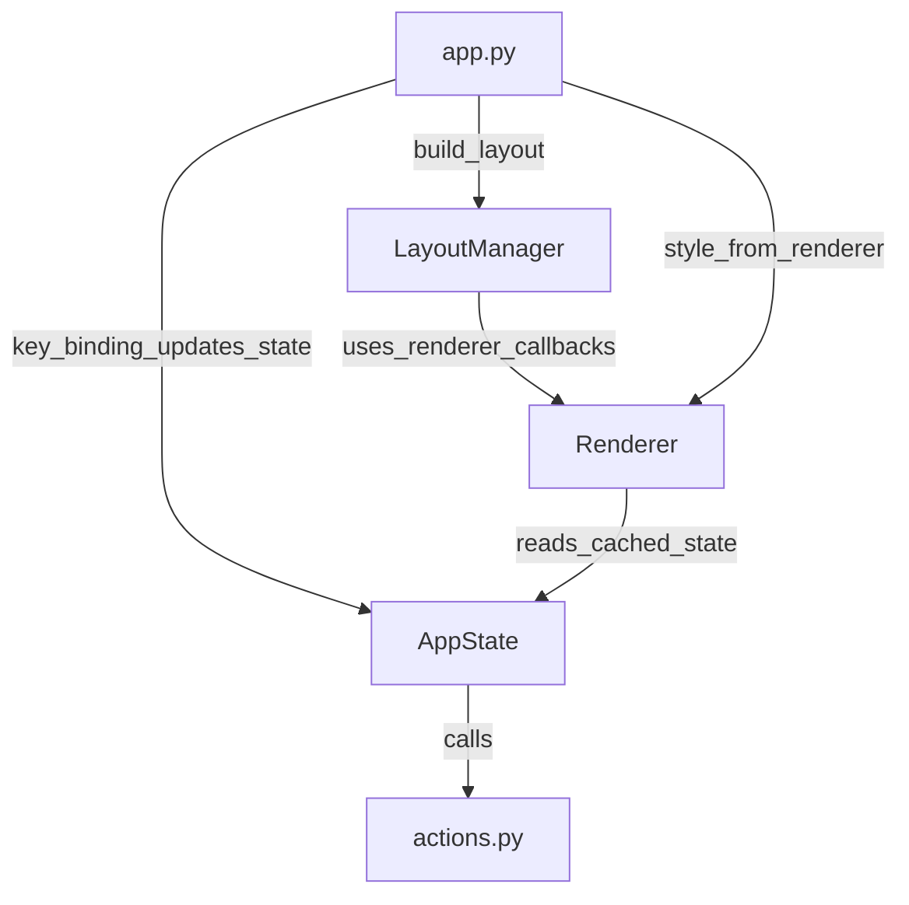

————————
MukiTodo — Version History / 更新记录
————————

### v0.01 2025-12-6 MVP

这是 MukiTodo 的第一个最小可用版本
我需要的不止是简单的分类 Todo 列表，而是以「项目」为核心的管理系统

版本主要内容：
1. 确定初始项目结构
2. 确定 Track -> Project -> Item 的 Todo 层级结构
3. 确定 TUI -> Actions -> Services -> Models -> Database 架构
4. 确定 TUI 界面，设计两种操作模式：NORMAL MODE 和 COMMAND MODE。NORMAL MODE 使用方向键这种符合直觉的操作方式，COMMAND MODE 则是命令模式，精确性、拓展性更强
5. 数据存储使用 SQLite 储存在 home 目录下
6. 实现 Track、Project、Item 的增删改查功能

### v0.0.2 2025-12-10 重大更新: 架构设计 / NOW 行动器

这是 MukiTodo 的第二个最小可用版本

1. 重新设计功能设计，逻辑完成 README 的初步编写，包括简介 / 理念，功能设计及设计理念，界面与交互设计等
2. 新增 NOW 行动器的实现
3. 重构 TUI 代码
    1. 重构 TUI state，使用 AppState 类管理状态，以及 NowState 类管理 NOW 行动器状态，StructureState 类管理结构状态
    2. 重构 TUI renderer，改为 OOP 逻辑，使用 Renderer 类管理渲染逻辑，优化显示
    3. 实现不同 View 下的不同 Layout 界面
```text
├── mukitodo/
│   ├── tui/                # prompt-toolkit TUI 应用
│   │   ├── __init__.py     # 初始化
│   │   ├── state.py        # 状态管理
│   │   ├── renderer.py     # 渲染器
│   │   └── app.py          # 按键绑定 + 启动入口
├── ...
```

v0.0.2 Code Hierarchy / Data Flow

```
cli.py
    -> tui/app.run()
        -> tui/state.AppState()
            -> tui/renderer.Renderer(tui_state)
        -> tui/app.key_bindings
            -> actions: excute action
                -> services: request database operations
                -> models: return model objects
```


### v0.0.3 (a) 重大更新: 全新功能设计 / 全新架构设计 / 全新数据库设计 / 大重构

大重构：
1. TUI 只负责交互，tui/app.py 在 tui/state.py 中读写 TUI 状态，所有操作仅与 actions.py 交互，TUI state 仅进行 UI 逻辑检查，不进行业务逻辑检查
2. 取消 Action -> Service -> Model 架构，改为 actions.py 直接操作数据库
3. 未来的 CLI 命令行入口将不再直接操作 AppState 状态，也通过 actions.py 行动

actions.py 设计原则：
1. 以业务操作命名，表达功能操作/用户意图
2. 不直接返回 Model 数据对象，而是通过 actions 解包为基础类型，例如 str / dict / list 数据
3. 未来同时支持 TUI 和 CLI
4. 使用 Context 管理数据库操作


数据库全面重新设计：
Track | Project | TodoItem | IdeaItem | NowSession | Takeaway

新功能架构设计：
1. Box 收集箱
2. ...

NOW 行动器澄清：计时的时候不保存至数据库，而是保存在 TUI 状态中，对于 CLI，当前不设计计时功能。在停止后，用户确认之后（通常同时记录 Takeaways），才保存至数据库。

待实现功能：
1. 当前版本 CLI 仅实现进入 TUI 和 help 两个命令
2. 排序功能

v0.0.3 Code Hierarchy / Data Flow

```
cli.py
    -> tui/app.run()
        -> tui/states/app_state.AppState()
            -> tui/renderer.Renderer(tui_state)
        -> tui/app.key_bindings
            -> actions: excute action
                -> models: return model objects
```

### v0.0.3 (b) 重大更新: TUI 重构

1. 重构 TUI 状态管理
    1. TUI 状态管理分为 View 和 UIModeState 两个部分
    2. 在 AppState 中综合管理 View 和 UIModeState 状态
    3. 不同的 View 使用不同的 State 类管理状态，目前有 NowState、StructureState、InfoState 三个状态类，分别管理自身 View 的状态
    4. 重构消息关系，使用 MessageHolder 类管理消息，所有 State 类都可以访问 MessageHolder 类
    5. 以优雅的原则重构了 AppState, NowState, StructureState, InfoState 类的实现
2. 重构 TUI 渲染器
    Renderer 实现原则：
    1. 只负责渲染，不负责业务逻辑
    2. 只与 State 类交互，不直接操作数据库，不与 actions.py 交互
3. 新增 View Info 视图，用于查看当前 Item 的详细信息

```
├── states/
│   ├── app_state.py
│   ├── info_state.py
│   ├── message_holder.py
│   ├── now_state.py
│   └── structure_state.py
```

### v0.0.3 (c) 2025-12-27 重大更新: 完善 TUI 架构，实现 Renderer 与 State 完全分离

1. 完善 State 类数据缓存，为 Renderer 提供可直接读取的数据，无需再调用 actions
2. 重构 app.py 布局设计
    1. 从 10 个 ConditionalContainer 优化为 4 个
    2. 每个 View 一个完整的 Container（NOW / STRUCTURE / INFO）为每个 View 提供独立的渲染方法
    3. Separator 和 Status Bar 改为全局共享，全宽显示
    4. 添加布局常量，集中管理参数
3. 完全移除 Renderer 对 actions 的依赖，所有数据从 State 读取（`now_state.current_project_dict` / `structure_state.current_tracks_list` 等）

架构优势：
- 数据流向单一：State → Renderer（Renderer 不再有副作用）
- 职责分离清晰：State 管理数据，Renderer 负责渲染
- 可维护性提升：布局结构一目了然，易于扩展

4. 完善 README.md 文档


### v0.0.4 (a) 状态切换以及排序功能、Archive 功能 2025-12-29

1. 实现 Item 的各状态切换功能（Sleep, Cancel, Archive, ...）✅
2. 实现 Structure View 根据 Item 状态排序功能并用不同样式显示✅
    - Track: Active > Sleeping
    - Project: Focusing > Active > Sleeping > Finished > Cancelled
    - Todo: Active > Sleeping > Done > Cancelled
3. 实现 Archive 面板（View）✅

### v0.0.4 (b) 2025-12-30 实现 Timeline View

1. 新增 Timeline View，用于查看所有 NOW Session 的时间线记录✅
    - 显示所有历史 Session 记录，按时间倒序排列
    - 显示 Session 的基本信息：项目名称、开始时间、持续时间、收获（Takeaways）等
    - 支持按项目、日期等维度筛选和排序
2. 重构 INFO View 并优化其显示逻辑
    - 完善 Session， Takeaway 详细信息的展示，包括状态、描述、关键日期等
    - 改进输入框布局以支持多行编辑


### v0.0.4 (c) 2025-12-30 重大更新: 重构 Input Mode

1. 重构 Input Mode 为「两行表单 + 真·就地编辑」✅
    - 新增 InputState 类管理 Input Mode 状态
    - 新增两行 Input 面板（分割线与状态栏保持不变），光标直接在字段处编辑
    - `Tab/Shift+Tab` 切字段，`Space/+/-/↑↓` 调整枚举/数值字段，`Enter` 提交，`Esc/Ctrl+G` 取消
2. Input Mode 支持多类型、多字段编辑（v1：单行、溢出不处理）✅
    - Track: Name, Description, Status
    - Project: Name, Description, Deadline, Status, Willingness/Importance/Urgency
    - Todo: Name, Description, Deadline, Status
    - Idea: Name, Description, Status, Maturity/Willingness
    - Takeaway: Title, Content, Type, Date

v0.0.4 (d) 2026-12-31 重构 TUI，新增 TUI Layout Manager

TUI Data Flow: (New)



### v0.0.4 (e) 2026-12-31 Box 收集箱 ✅

1. 新增 BOX 视图（`b` 进入/退出），包含 Box Todos / Box Ideas 两个子视图（`[` / `]` 切换）✅
2. BOX 内支持新增/编辑/归档/删除/详情查看 ✅
3. 实现 Box Todo move（到 Structure 选择目标后 `Enter` 确认）✅
4. 实现 Box Idea promote（到 Structure 选择目标后 `Enter` 确认；已 promoted 的 idea 禁止再次 promote）✅
5. Archive 补齐 Archived Box Todos，并支持解档后跳回 BOX ✅


当前目录结构：
```
├── mukitodo/
│   ├── __init__.py         # Package init
│   ├── cli.py              # CLI entry point ("todo" command)
│   ├── actions.py          # Business logic
│   ├── database.py         # Database connection & setup
│   ├── models.py           # SQLAlchemy ORM models
│   └── tui/                # prompt-toolkit Terminal UI Application
│       ├── __init__.py     # TUI package core
│       ├── app.py          # Key bindings, layout, TUI app launcher
│       ├── layout_manager.py    # Dynamic layout computation
│       ├── renderer.py     # Pure rendering routines
│       ├── states/         # State management modules
│       │   ├── app_state.py        # Top-level state coordinator
│       │   ├── input_state.py      # Input MODE state
│       │   ├── now_state.py        # NOW VIEW state
│       │   ├── structure_state.py  # STRUCTURE VIEW state
│       │   ├── info_state.py       # INFO VIEW state
│       │   ├── timeline_state.py   # TIMELINE VIEW state
│       │   ├── archive_state.py    # ARCHIVE VIEW state
│       │   ├── box_state.py        # BOX VIEW state
│       │   └── message_holder.py   # Message/Result manager
```

至此，所有主要功能均已实现，包括：
1. NOW 行动器
2. STRUCTURE 结构
3. BOX 收集箱
4. ARCHIVE 归档视图
5. TIMELINE 时间线视图
6. INFO 信息视图
以及各模式间的交互

未来将进行适度的重构优化，以及大规模的体验优化
