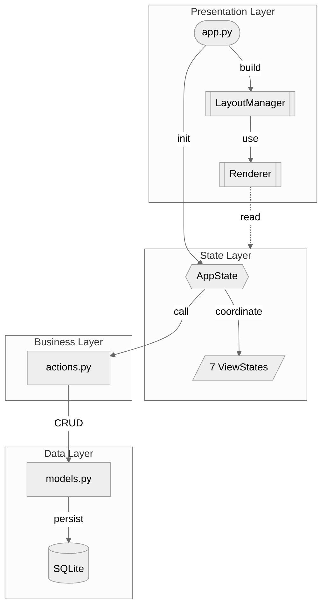

# ToFlow

<div align="center">


**Focus, Action, Growth. All inside your terminal.**

[](https://www.python.org/downloads/)
[](https://github.com/astral-sh/uv)
[](https://opensource.org/licenses/MIT)
[](https://github.com/prompt-toolkit/python-prompt-toolkit)

**English** | [简体中文](./README_zh.md)

---


</div>

## Documentation

|  |  |
|--|--|
| **[📖 Philosophy](./docs/PHILOSOPHY.md)** | Why do we need another Todo App? Deep dive into ToFlow's design philosophy. |
| **[🕹️ User Manual](./docs/MANUAL.md)** | Full cheat sheet for shortcuts, navigation maps, and core workflows. |
| **[🛠️ Developer Guide](./docs/DEVELOPER.md)** | System architecture, data models, and contribution guide. |
| **[📝 Changelog](./CHANGELOG.md)** | 10+ version iterations, including 3 major architecture refactors. |

---

## The Problem

Traditional todo lists are **flat**. But real life is not.

You have multiple life directions (career, health, family), dozens of ongoing projects, and hundreds of small tasks. When everything piles up in a single list, you face:

1. **Chaos** — No structure, no priority, endless scrolling.
2. **Decision Paralysis** — "What should I do now?" becomes daily torture.
3. **No Accumulation** — Tasks disappear after completion. A year later, you have no idea where your time went.

ToFlow is designed to solve these problems.

---

## Core Features

**🎯 Structured Life** — With the **Track → Project → Todo** hierarchy, every task has a home, serving your long-term goals.

**⏱️ Flow State** — Built-in **Now Mode**, a minimalist Pomodoro timer. Start stress-free, execute immersively.

**📅 Timeline Review** — All focus records are automatically saved to the **Timeline**, making every effort traceable.

**📥 Inbox** — **Box** serves as a buffer for Ideas and Todos. Capture inspiration now, organize later.

**⌨️ Keyboard Driven** — Efficient keybindings, millisecond response, fingers never leave the keyboard.

---

## Quick Start

ToFlow is built with Python. We recommend using `uv` for building and running.

```bash
# 1. Clone the repo
git clone https://github.com/mukii/toflow.git
cd toflow

# 2. Install dependencies
uv sync

# 3. Run
uv run toflow
```

*The database will be automatically initialized at `~/.toflow/toflow.db` on first run.*

---

## Architecture Overview

ToFlow adopts a **unidirectional layered architecture** where each layer only depends on the layer below, never calling upward.



**Layer Responsibilities**

| Layer | Component | Description |
|:--:|------|------|
| **Presentation** | `app.py` | Keybindings, application entry |
| | `LayoutManager` | prompt-toolkit layout construction |
| | `Renderer` | Pure rendering, read-only state |
| **State** | `AppState` | Global coordinator |
| | `7 ViewStates` | Now / Structure / Box / Timeline / Archive / Info / Input |
| **Business** | `actions.py` | Business intent encapsulation, unified Result pattern returns |
| **Data** | `models.py` | 5 Entity ORM (Track / Project / Todo / Idea / Session) |
| | `SQLite` | Local persistence `~/.toflow/toflow.db` |

> 📝 **10+ version iterations, 3 major refactors** — See [CHANGELOG](./CHANGELOG.md) for the full evolution history.


---

<div align="center">

Made with ❤️ by Mukii

[MIT License](./LICENSE)

</div>
