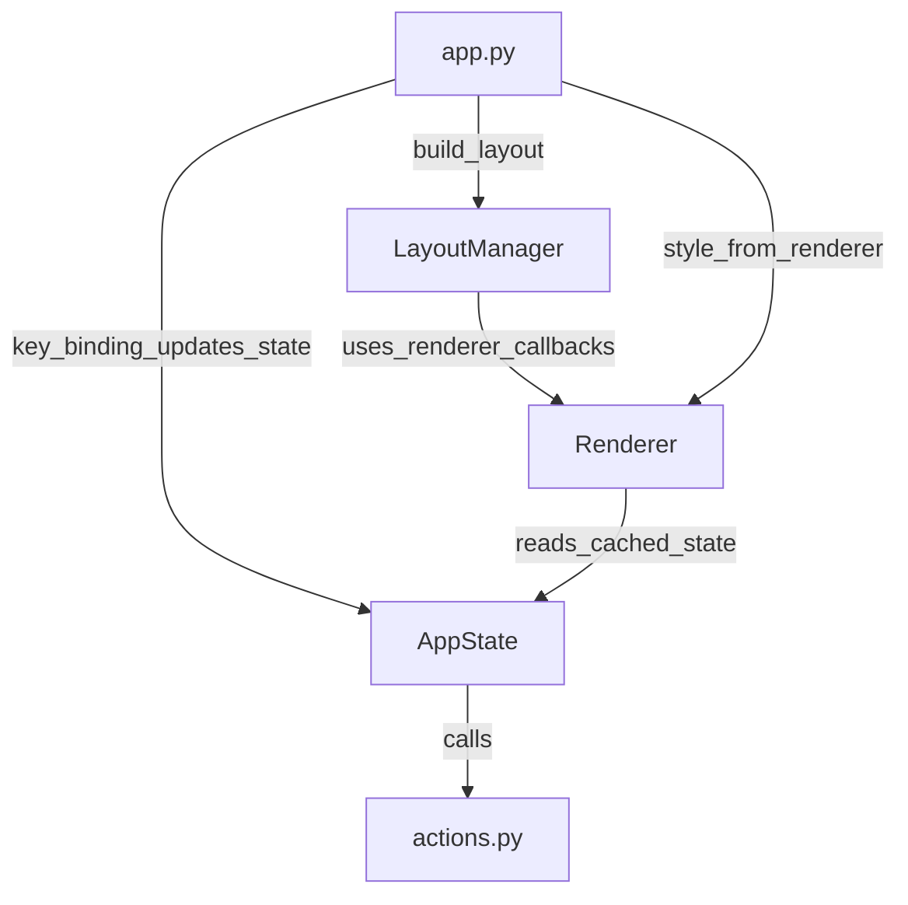

# Changelog

**[English](./CHANGELOG.md)** | [简体中文](./CHANGELOG_zh.md)

All notable changes to this project will be documented in this file.

## [Future]

1. URL parsing and jumping
2. Record Done List
3. NOW Actioner: Task recommendation
4. NOW Actioner: Pin Item
5. Remove local time fields in Model, use UTC for all times
6. Chinese input method optimization
7. **Architecture Refactor: Unified Item & View Abstraction**
    - Unify Track/Project/Todo/Idea/Session as `Item` with common interface (id, name, status, parent, children)
    - Unify all views as `ItemListView` (items + cursor + navigation)
    - Unify operations as `Action` (Move, Delete, Archive, StatusChange)
    - Unify modes: Browse, SelectTarget, Input, Confirm
    - Centralized message management (sub-states return results, app_state handles messages)
    - Simplify key bindings (navigate/confirm/cancel delegate to app_state based on mode)

## [v0.1.1] - 2026-01-29 Structure Move

**New Feature**: Move Project/Todo within STRUCTURE view (press `m`)
- Project can be moved to another Track
- Todo can be moved to another Project
- Reuses the same interaction pattern as Box move (m → navigate → Enter to confirm)
- Persistent hint message during move mode

**Implementation**:
- `actions.py`: Add `move_project_to_track()`
- `app_state.py`: Add `CONFIRM_STRUCTURE_MOVE`, `start_pending_move_from_structure()`, `get_pending_transfer_hint()`, `refresh_pending_transfer_hint()`
- `app.py`: Add `m` key binding for STRUCTURE view, refresh hint after navigation

## [v0.1.0] - 2026-01-15
**Fix bugs, optimize experience, launch on GitHub, rename to ToFlow**

## [v0.0.9] - 2026-01-04 Major Update

**Plan:**
1. **Time display optimization**: Display local time.
    - Timeline: Group by local date; Session time shows local time (HH:MM).
    - Info: All datetime fields show local time.
    - Data stored as UTC; Models unify SQLite naive datetime as UTC.
2. **Reordering**: Add order adjustment (Alt+Up/Down, order_index) for structure (track/project/todo) and box (todo/idea).
3. **Major Change**: Cancel "Takeaway" and all related features. Record session description instead when session ends.
4. **Adjustment**: Add `pinned` field, remove project `focusing` status.

## [v0.0.8] - 2026-01-02 NOW Completion Reminder & Rest

- Bell reminder when 5 minutes left.
- When timer ends:
    - Bell reminder.
    - Activate iTerm2 (macOS) to foreground.
    - Auto-enter Finish Session flow, ask for description and save.
    - If cancelled, reset timer.
    - If saved, enter 5-minute Rest mode (Press Space to start).
    - Bell reminder when rest ends, then reset timer.

## [v0.0.7] - 2026-01-02 TODO Quantity/Stage Feature

**New Requirement**: Some todos have multiple stages or repetitions (e.g., 10 LeetCode problems).
Added `total_stages` and `current_stage` fields to track progress.

**Implementation Details (v1):**
- Space (STRUCTURE -> TODOS):
    - status=active: current_stage +1. If reaches total_stages, auto mark done.
    - status=done: Undo done (status->active), current_stage = total_stages-1.
    - status=sleeping/cancelled: Restore to active only.
- Input Mode (Todo Add/Edit):
    - Added T (total_stages) and S (current_stage) chips. Adjust with arrows/keys.
    - Manual adjustment limited to total_stages-1.
    - Cannot adjust current_stage if done.
- UI:
    - Show progress `[current/total]` in STRUCTURE / BOX / NOW / ARCHIVE.
- Database:
    - No migration; please delete `~/.mukitodo/todo.db` to rebuild.

## [v0.0.6] - 2026-01-01 Polish, First Complete Usable Version

1. Optimize shortcuts.
2. Optimize view switching logic.
3. Optimize Input field display.
4. Bugfix: Focus lost after adding item. Now focuses on the new item.

## [v0.0.5 (a)] - 2026-01-01 TUI Renderer Overhaul

**Optimization / Bugfix**
1. Fix display issue: Content exceeds vertical range in views.
    - Implemented "Implicit Scroll" (Auto-shift) instead of scrollbars.
    - Supported in all Structure levels.
    - Tracks with Projects: Prioritize showing current Track box.
2. Refactor Renderer Structure
    - `tui/renderer/` directory. Separated Renderer and LayoutManager.
    - `renderer/blocks.py`: Generate lines by blocks.
    - `renderer/constants.py`: Centralized layout constants.

**Code Hierarchy / Data Flow (v0.0.5a)**

```
cli.py
    -> tui/app.run()
        -> tui/states/app_state.AppState()
            -> tui/states/now_state.NowState()
            -> tui/states/structure_state.StructureState()
            -> tui/states/info_state.InfoState()
            -> tui/states/timeline_state.TimelineState()
            -> tui/states/archive_state.ArchiveState()
            -> tui/states/box_state.BoxState()
            -> tui/states/message_holder.MessageHolder()
        -> tui/renderer/LayoutManager.build_layout()
            -> tui/renderer/Renderer.render_xxx_view_content()
                -> tui/renderer/blocks: build blocks -> lines + selection
                -> renderer viewport: apply implicit scroll
        -> tui/app.key_bindings
            -> actions: excute action
                -> models: return model objects
```

## [v0.0.4 (e)] - 2025-12-31 Box Inbox

1. New BOX View (`b` to enter/exit), sub-views Box Todos / Box Ideas (`[` / `]`).
2. Support Add/Edit/Archive/Delete/Info in BOX.
3. Box Todo Move (Select target in Structure -> Enter).
4. Box Idea Promote (Select target in Structure -> Enter; Prevent re-promote).
5. Archive supports Archived Box Todos.

**Directory Structure:**
```
├── mukitodo/
│   ├── __init__.py         # Package init
│   ├── cli.py              # CLI entry point ("todo" command)
│   ├── actions.py          # Business logic
│   ├── database.py         # Database connection & setup
│   ├── models.py           # SQLAlchemy ORM models
│   └── tui/                # prompt-toolkit Terminal UI Application
│       ├── __init__.py     # TUI package core
│       ├── app.py          # Key bindings, layout, TUI app launcher
│       ├── layout_manager.py    # Dynamic layout computation
│       ├── renderer.py     # Pure rendering routines
│       ├── states/         # State management modules
│       │   ├── app_state.py        # Top-level state coordinator
│       │   ├── input_state.py      # Input MODE state
│       │   ├── now_state.py        # NOW VIEW state
│       │   ├── structure_state.py  # STRUCTURE VIEW state
│       │   ├── info_state.py       # INFO VIEW state
│       │   ├── timeline_state.py   # TIMELINE VIEW state
│       │   ├── archive_state.py    # ARCHIVE VIEW state
│       │   ├── box_state.py        # BOX VIEW state
│       │   └── message_holder.py   # Message/Result manager
```

## [v0.0.4 (d)] - 2025-12-31 TUI Refactor, Layout Manager

**TUI Data Flow (New):**



## [v0.0.4 (c)] - 2025-12-30 Major Update: Refactor Input Mode

1. Refactor Input Mode to "Two-line Form + Inline Edit".
    - `InputState` class.
    - Tab/Shift+Tab to switch fields, Space/Arrows to adjust.
2. Support Multi-type/Multi-field editing.
    - Track, Project, Todo, Idea, Takeaway fields supported.

## [v0.0.4 (b)] - 2025-12-30 Timeline View

1. New Timeline View for session history.
    - Reverse chronological order.
    - Session info (Project, time, duration).
2. Refactor INFO View.

## [v0.0.4 (a)] - 2025-12-29 Status Switching, Sorting, Archive

1. Item status switching (Sleep, Cancel, Archive).
2. Structure View sorting by status (Active > Sleeping > ...).
3. Archive View.

## [v0.0.3 (c)] - 2025-12-27 Major Update: TUI Architecture Perfection

1. Perfect State caching for Renderer.
2. Refactor `app.py` layout design (4 Containers).
3. Remove Renderer dependency on Actions.
4. Improve README.

**Architecture Benefits:**
- Unidirectional Data Flow: State → Renderer
- Separation of Concerns: State manages data, Renderer handles display
- Maintainability: Clear layout structure

## [v0.0.3 (b)] - Major Update: TUI Refactor, Info View

1. Refactor TUI State Management (View vs UIModeState).
2. Refactor TUI Renderer (Pure rendering).
3. New Info View.

```
├── states/
│   ├── app_state.py
│   ├── info_state.py
│   ├── message_holder.py
│   ├── now_state.py
│   └── structure_state.py
```

## [v0.0.3 (a)] - Major Update: Functional/Architecture/Database Overhaul

**Refactor:**
1. TUI only handles interaction; logic in `actions.py`.
2. Remove Action -> Service -> Model, use direct DB operations.
3. CLI support preparation.

**Actions Design:**
1. Named by user intent.
2. Return basic types (dicts), not Models.
3. Context manager for DB.

**Database Redesign:**
Track, Project, TodoItem, IdeaItem, NowSession.

**Now Actioner Clarification:**
Timing state in TUI, save to DB only on finish.

**v0.0.3a Code Hierarchy / Data Flow:**
```
cli.py
    -> tui/app.run()
        -> tui/states/app_state.AppState()
            -> tui/renderer.Renderer(tui_state)
        -> tui/app.key_bindings
            -> actions: excute action
                -> models: return model objects
```

## [v0.0.2] - 2025-12-10 Major Update: Architecture / NOW Actioner

1. Redesign functions and write README.
2. Implement NOW Actioner.
3. Refactor TUI code (AppState, Renderer, Layouts).

**v0.0.2 Code Hierarchy / Data Flow:**
```
cli.py
    -> tui/app.run()
        -> tui/state.AppState()
            -> tui/renderer.Renderer(tui_state)
        -> tui/app.key_bindings
            -> actions: excute action
                -> services: request database operations
                -> models: return model objects
```

## [v0.01] - 2025-12-6 MVP

First minimal viable version of MukiTodo (ToFlow).
Goal: Project-centric management system.

**Contents:**
1. Initial Project Structure.
2. Track -> Project -> Item hierarchy.
3. TUI -> Actions -> Services -> Models -> Database architecture.
4. Normal Mode / Command Mode.
5. SQLite storage.
6. CRUD for Track/Project/Item.
